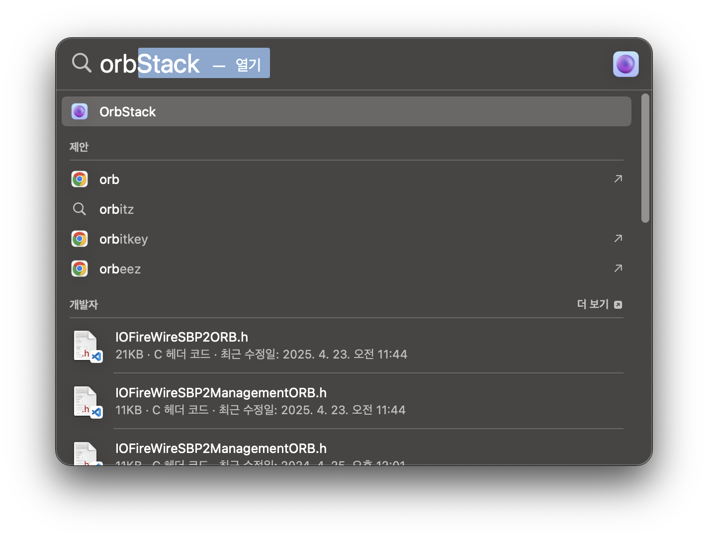
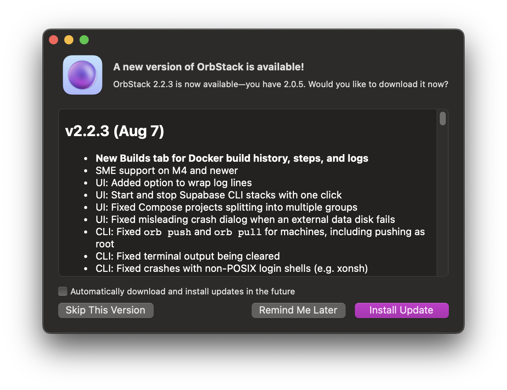
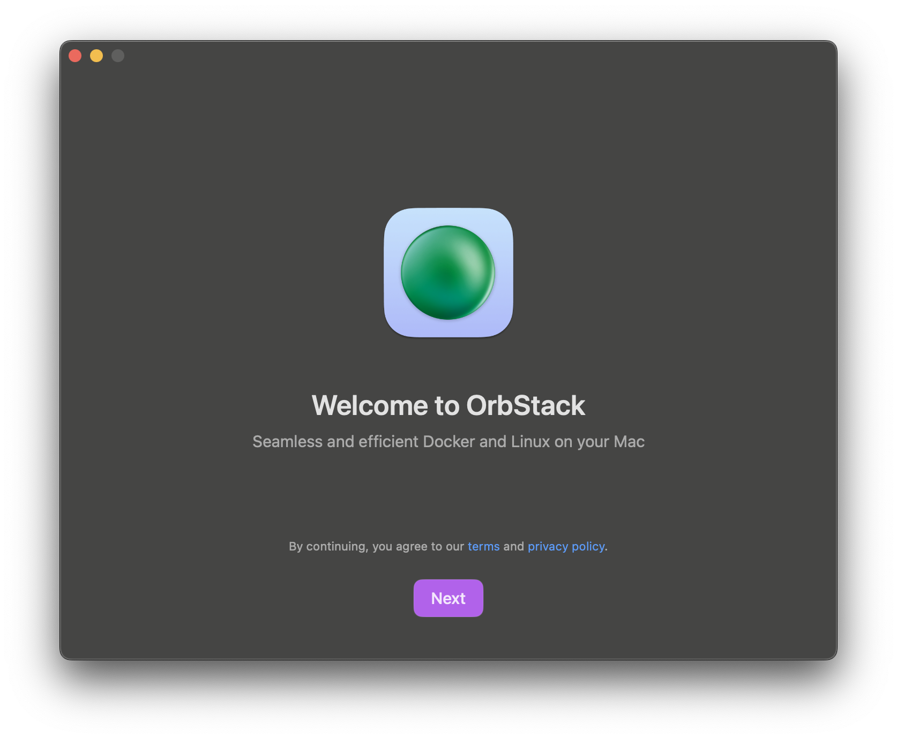
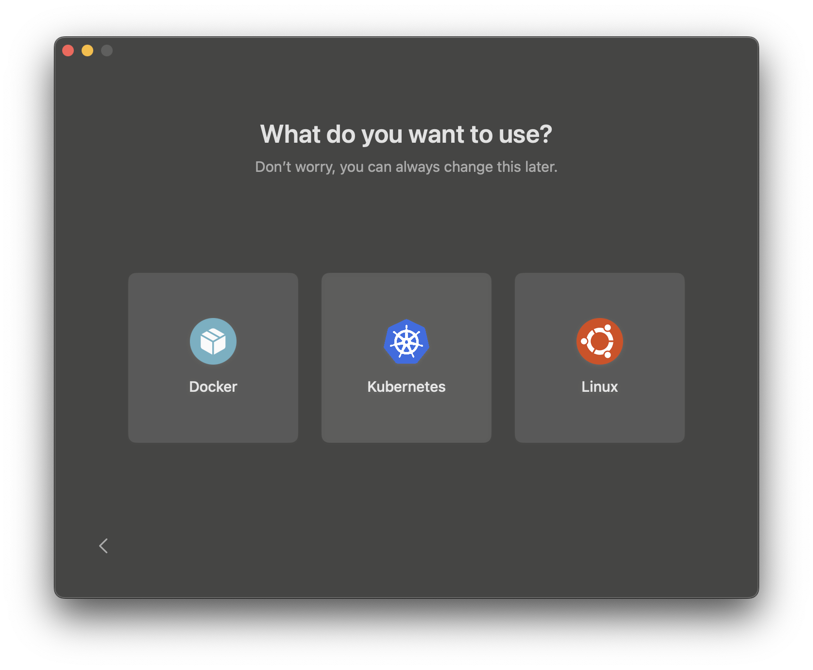

# 코디세이 Tailscale 원격 환경 설정

이 저장소는 [코디세이](https://codyssey.kr/) 교육장에서 사용하는 macOS 장비에 Tailscale 기반 원격 접속 환경을 빠르게 다시 구성하기 위한 초기화 도구와 절차를 담고 있습니다.

교육장에서는 자리를 옮겨 다른 장비를 사용하거나, 주 2회 진행되는 장비 초기화 이후 개발 환경을 다시 설정해야 합니다. 이 저장소를 복제하고 준비된 스크립트를 실행하면 매번 동일한 원격 환경을 간단히 재구성할 수 있습니다.

교육장 macOS에서는 `sudo`를 사용할 수 없으므로, 미리 설치된 OrbStack의 Docker 실행 환경에서 Tailscale과 GOST를 구동합니다. Tailscale로 원격 장비가 속한 tailnet에 연결하고, GOST를 통해 SSH 등의 서비스를 로컬 포트로 전달합니다. 아래 절차는 OrbStack이 이미 설치되어 있다는 전제입니다.

## 1. OrbStack 최초 실행

Spotlight(`Command` + `Space`)에서 **OrbStack**을 검색해 직접 실행합니다.



처음 실행하면 업데이트 안내 창과 시작 안내 창이 함께 나타날 수 있습니다.

1. 업데이트 안내 창에서 **Skip This Version**을 클릭합니다.
2. 시작 안내 창에서 **Next**를 클릭합니다.





아래와 같은 기능 선택 화면이 나타나면 OrbStack 초기 구동이 완료된 것입니다. 이 창은 닫아도 됩니다. 이후에는 OrbStack 앱 창이 열려 있을 필요가 없습니다. 다만 메뉴 막대에서 OrbStack을 종료하지 말고, Docker 엔진은 백그라운드에서 계속 실행되도록 둡니다.



## 2. 저장소 복제

터미널에서 다음 명령을 실행합니다.

```sh
git clone https://github.com/mjy90884682/init.git
cd init
```

## 3. 환경 변수 설정

예제 파일을 복사해 `.env` 파일을 만들고, `TS_AUTHKEY` 값을 발급받은 Tailscale 인증 키로 변경합니다.

```sh
cp .env.example .env
```

```dotenv
TS_AUTHKEY=tskey-auth-...-...
```

인증 키는 [Tailscale 관리 콘솔](https://console.tailscale.com/admin/machines/new-linux)에서 발급할 수 있습니다. `.env`에는 비밀 정보가 포함되므로 Git에 커밋하지 마세요.

## 4. 서비스 실행 및 관리 화면 접속

OrbStack의 Docker 엔진이 백그라운드에서 실행 중인지 확인한 뒤 다음 명령을 실행합니다. OrbStack 앱 창은 닫혀 있어도 됩니다.

```sh
sh init.sh
```

`init.sh`는 아래 Docker Compose 서비스를 백그라운드에서 시작하고, GOST UI가 준비되면 Chrome으로 관리 화면을 엽니다.

- Tailscale
- GOST
- GOST UI

자동으로 열리지 않으면 Chrome에서 [http://localhost:18081/](http://localhost:18081/)을 직접 엽니다. 로그인 화면에는 다음 값을 입력합니다.

| 항목 | 값 |
| --- | --- |
| API 주소 | `http://localhost:18080` |
| 사용자 이름 | 입력하지 않음 |
| 비밀번호 | 입력하지 않음 |

두 주소 모두 이 Mac의 로컬 인터페이스에서만 접근할 수 있습니다.

## 5. SSH 터널 추가

GOST UI의 **Services**에서 서비스를 추가하면 Tailscale에 연결된 원격 장비의 SSH 포트를 이 Mac의 로컬 포트로 전달할 수 있습니다. 예를 들어 원격 장비의 Tailscale IP가 `100.64.0.10`이고 로컬 포트 `2222`를 사용하려면 다음과 같이 설정합니다.

| 항목 | 값 | 설명 |
| --- | --- | --- |
| Name | `SSH - server-name` | 장비를 구분할 이름 |
| Addr | `127.0.0.1:2222` | 이 Mac에서 접속할 로컬 주소와 포트 |
| Handler Type | `tcp` | SSH 트래픽을 TCP로 전달 |
| Handler Chain | `tailnet` | Tailscale SOCKS5 경로 사용 |
| Listener Type | `tcp` | 로컬 TCP 포트 수신 |
| Forwarder Node Name | `server-name` | 대상 장비를 구분할 이름 |
| Forwarder Node Addr | `100.64.0.10:22` | 대상 장비의 Tailscale IP와 SSH 포트 |

서비스를 추가하면 설정이 즉시 적용됩니다. 터미널에서 다음과 같이 접속해 확인합니다.

```sh
ssh -p 2222 <원격-사용자명>@localhost
```

로컬 포트는 SSH 터널마다 겹치지 않게 지정합니다(예: `2222`, `2223`, `2224`). `Addr`를 `127.0.0.1`로 제한하면 같은 Mac에서만 터널에 접속할 수 있습니다.

UI에서 변경한 서비스는 현재 실행 중인 GOST에 즉시 반영되지만, 컨테이너를 다시 만들거나 재시작한 뒤에도 유지하려면 UI의 **Save Config** 기능으로 현재 설정을 `gost.yaml`에 저장해야 합니다. 저장 후 [gost/gost.yaml](gost/gost.yaml)에 변경 내용이 반영되었는지 확인하세요.

## 상태 확인 및 종료

```sh
# 실행 상태 확인
docker compose ps

# 로그 확인
docker compose logs -f

# 서비스 종료
docker compose down
```
