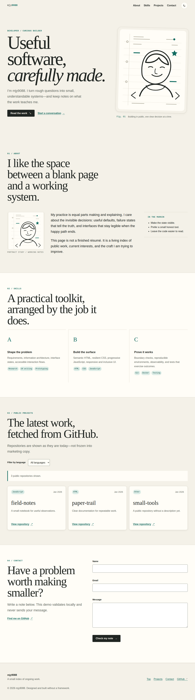
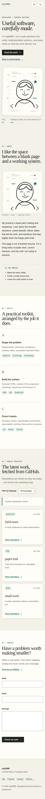
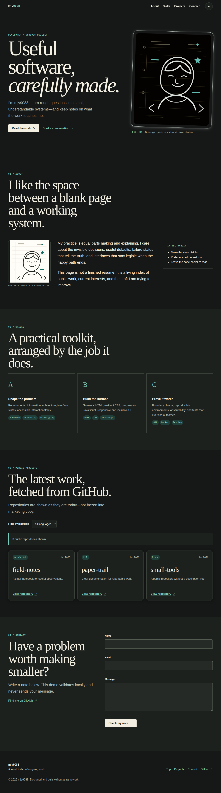

# Margin Notes: Developer Portfolio

`mjy9088`'s portfolio is built with plain HTML, CSS, and JavaScript. It presents interface state
clearly, accounts for network failure and keyboard use, and avoids invented career or achievement
claims. The profile illustration and copy were created for this project.

**This entire directory is the self-contained submission unit.** It runs and can be tested with
Docker Engine and Compose without the parent monorepo, DIM, Git, host Node.js, Python, or a host QEMU
installation. On macOS or Windows, use a Docker environment that supports Linux containers. Shell
examples target a POSIX shell on macOS, Linux, or WSL.

## Automated verification

Copy this directory to an independent location, enter it, and choose a verification path:

```sh
# Containerized HTTP server and Chromium tests
sh scripts/verify.sh docker

# QEMU Linux guest HTTP server and the same Chromium tests
sh scripts/verify.sh vm

# Both paths in sequence
sh scripts/verify.sh all
```

The suite checks responsive layouts at mobile, tablet, and desktop widths; light and dark themes;
navigation and focus behavior; API loading, success, empty, malformed, rate-limited, delayed, and
network-error states; form validation; content safety; accessibility rules; and VM guest identity.
GitHub responses in tests are deterministic synthetic fixtures. They do not demonstrate live API
availability or the existence of any repository.

The first build downloads container images, npm packages, and Alpine artifacts. A fully offline first
build without a prepared cache is not supported. Dependencies use a lockfile, base images use
digests, and VM artifacts use published checksums. Allow approximately 6 GiB of free disk and 2 GiB
of memory for the browser image and software-emulated VM.

The verification script uses a unique Compose project name and removes its containers and networks
after success, failure, or interruption. Docker image and build caches remain available for later
runs. Runtime results, logs, traces, and non-submission screenshots belong in ignored local output or
CI artifacts rather than Git.

See [the review guide](docs/REVIEW.md) for test scope and manual evaluation guidance.

## Preview the site

```sh
docker compose -f compose.yaml -f compose.preview.yaml up --build -d --wait web
# Open http://127.0.0.1:8080 on the Docker daemon host.
docker compose -f compose.yaml -f compose.preview.yaml down
```

The verification configuration has no host port and uses an internal-only network. The preview
overlay adds an accessible network and binds to loopback by default. If the port is occupied, use
`PORT=18080`. With remote Docker or DinD, `127.0.0.1` refers to the daemon host; use an appropriate
tunnel or development gateway. Change `BIND_ADDRESS` only when needed and review the resulting
network exposure.

### Direct Compose commands

```sh
docker compose --profile verify build web verify
docker compose up -d --wait web
docker compose --profile verify run --rm verify
docker compose --profile verify down --volumes

docker compose --profile vm --profile verify build vm verify
docker compose --profile vm up -d --wait vm
docker compose --profile verify run --rm -e BASE_URL=http://vm:8080 -e VERIFY_MODE=vm verify
docker compose --profile vm --profile verify down --volumes
```

The direct path removes the test container with `--rm`. Run the final cleanup command after a test
failure as well.

## Interface and behavior

- Hero, About, Skills, Projects, Contact, and Footer use meaningful HTML elements.
- Navigation uses Flexbox; projects use an `auto-fit`/`minmax` Grid. CSS custom properties control
  theme colors, typography, and spacing.
- Desktop navigation begins at 768px, and the wider hero arrangement begins at 1024px.
- The mobile menu supports its button, keyboard activation, Escape, and link selection. The page also
  provides a skip link, visible focus, explicit labels, field-level errors, and status announcements.
- Theme selection persists in `localStorage`. If storage is unavailable, the current page still
  changes theme; with no saved preference, the site follows the system theme.
- Header styling changes after 60px of scrolling, and the back-to-top control appears after 300px.
  Reveal behavior uses a 0.2 Intersection Observer threshold and respects reduced motion.
- The GitHub REST API request accepts at most 100 recent repositories, excludes forks, and renders up
  to 12 candidates. The language filter applies to those candidates. Loading, empty, error, and retry
  states are distinct; the request times out after eight seconds.
- The contact form validates name, email, and message. **It does not send email.** Its success state
  means local validation succeeded. Submission is disabled when JavaScript is unavailable.
- Dynamic card markup is developer-owned. API text is inserted with `textContent`, and link URLs are
  validated so remote strings are not interpreted as HTML.

See [the architecture reference](docs/ARCHITECTURE.md) for state boundaries and [DESIGN.md](DESIGN.md)
for the visual system. The site has no frontend runtime library. Playwright and axe are test-only
dependencies and are not deployed.

## Directory map

```text
index.html                  static page
css/style.css               style entry point and component rules
js/                         theme, navigation, API, and form modules
images/                     original SVG profile illustration
Dockerfile                  non-root static server
compose*.yaml               verification and preview configuration
verify/Dockerfile           pinned Chromium test environment
verify/vm/                  QEMU TCG guest and server
tests/                      synthetic API, behavior, accessibility, and responsive tests
scripts/verify.sh           container and VM verification orchestration
docs/                       architecture, review guide, and required screenshots
.github/workflows/pages.yml manual deployment when this subtree is a repository root
```

Verification uses build contexts and `docker cp`, not host-path bind mounts, and does not read above
this directory. As an optional development convenience, VS Code users may open this directory as the
workspace and preview `index.html` with Live Server; that workflow is not required for Docker tests.

## QEMU boundary

QEMU TCG boots a separate x86_64 Linux kernel, and a BusyBox HTTP server **inside the guest** serves
the same site files. Chromium runs in the test container, not in the VM. `/__vm-proof.txt` and the
serial stream expose guest kernel and emulated-hardware identity to the tests.

The VM path requires neither KVM, privileged containers, nor a host Docker socket. It targets amd64
Docker directly and uses x86_64 TCG on arm64. Platform-specific behavior should be evaluated on the
intended host rather than inferred from a different architecture. See [the VM reference](verify/vm/README.md)
for kernel and artifact details.

## GitHub Pages

No public deployment URL is currently available. Local verification is not deployment evidence.

The included Pages workflow is a template for a repository in which this subtree's contents,
including `.github/`, have become the repository root. GitHub does not discover this nested workflow
from its current monorepo location. Deployment and any push to a submission repository require
separate approval.

For an approved deployment:

1. Prepare a submission repository with this subtree at its root.
2. Review the projected files and history before pushing.
3. Set **Settings → Pages → Source** to **GitHub Actions**.
4. Run **Publish portfolio to Pages** manually.
5. Record the URL only after GitHub returns it, then evaluate the API, menu, theme, and form at that URL.

The workflow deploys only site files; tests, QEMU assets, documentation, and development dependencies
are excluded. The unauthenticated GitHub API is rate-limited, so automated tests use fixtures instead
of repeated live requests.

## Required screenshots

Versioning screenshots and other run artifacts is normally poor repository practice; keep them in CI
artifacts or ignored local output. The following three images are included **only because this
evaluation explicitly requires desktop, mobile, and dark screenshots**. They are illustrative
fixtures captured with synthetic API data, not proof that the current revision passes tests or is
deployed. The tablet capture used by responsive tests remains an ignored test artifact and is not a
tracked submission deliverable.

The same three files are also the visual-regression baselines; there is no duplicate screenshot
inventory. The pinned Chromium image, fixed viewport/device scale, locale, timezone, synthetic API
data, local artwork, settled fonts, and disabled animation/caret make captures repeatable. Both
container and QEMU tests compare against these baselines with zero permitted differing pixels.
Expected images are never updated by a normal test run. Differences produce actual/diff images in
ignored test output. Cross-architecture rendering differences still need review, not automatic acceptance.

To intentionally update the baselines after reviewing a design change:

```sh
UPDATE_SNAPSHOTS=1 sh scripts/verify.sh docker
```

This copies reference images back only if the entire functional suite succeeds. Review the three
image changes before committing, then rerun normal Docker and VM verification. Never use an update
to conceal a regression. Tests also work after this directory is copied independently.




