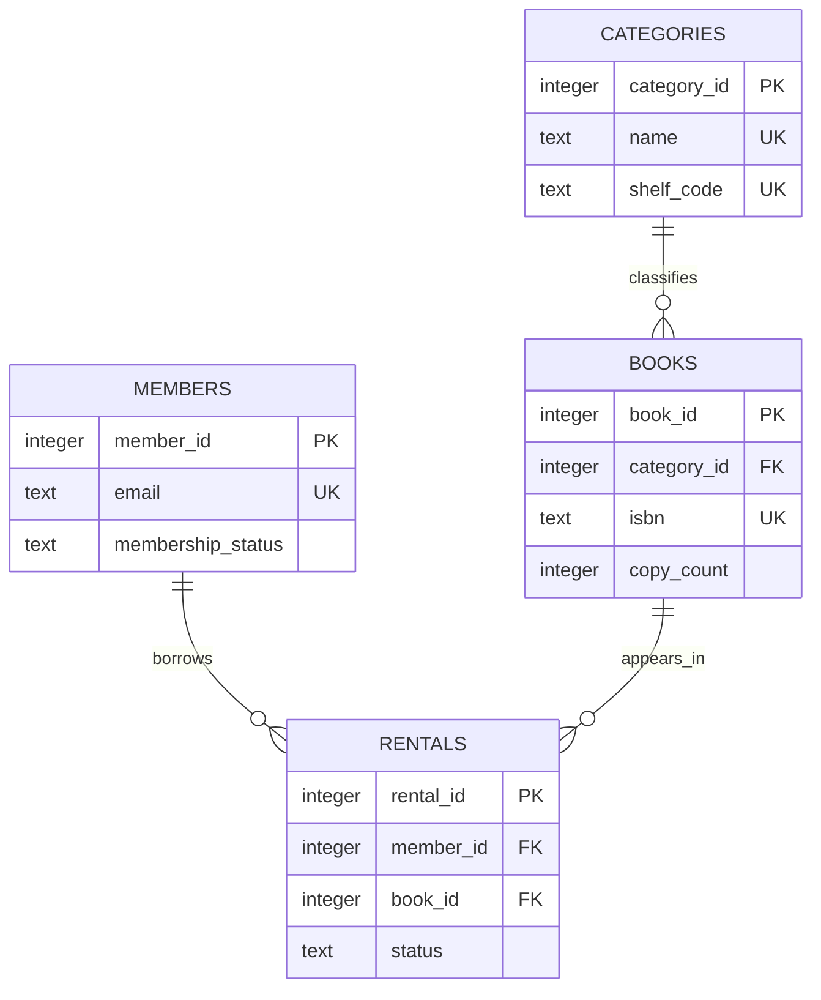

# Library Lending SQL Lab

This SQL-first exercise models a small library using SQLite 3.49.2. It contains no backend framework or network service: the deliverables are schema, deterministic sample records, 17 documented queries, and the required query-result text.

## Run

With a local SQLite CLI:

```sh
sqlite3 library.db < sql/01_schema.sql
sqlite3 library.db < sql/02_seed.sql
sqlite3 -header -separator '|' library.db < sql/03_queries.sql
```

Or run the complete isolated checks with Docker Engine and Compose:

```sh
sh scripts/verify.sh docker
sh scripts/verify.sh vm
sh scripts/verify.sh all
```

Docker mode builds from this directory, creates a fresh database in container tmpfs, verifies seed counts and rejected FK/UNIQUE violations, executes all queries, compares every row with the golden output, and checks final mutation state. VM mode boots an x86_64 Linux kernel with QEMU TCG and repeats the same SQLite checks inside the guest. Neither path needs KVM, privileged mode, capabilities, a bind mount, a host Docker socket, credentials, or parent-directory files.

## Data model



Separating categories, books, members, and rental events prevents repeated category/member details and lets foreign keys preserve relationships. The three one-to-many relationships are category-to-books, member-to-rentals, and book-to-rentals. Every table has at least ten synthetic rows; records use reserved `.test` addresses.

SQLite requires `PRAGMA foreign_keys = ON` per connection, so each executable SQL script and every explicit integrity probe enables it. Constraints cover primary keys, three natural-key uniqueness rules, required values, bounded years/copy counts, valid dates, rental statuses, and returned-date consistency. No views, procedures, or triggers are used.

## Query coverage

`sql/03_queries.sql` contains 17 independently labeled requirements:

| Range | Coverage |
| --- | --- |
| Q01–Q04 | Basic filters, ordering, and limits |
| Q05–Q08 | Multi-table inner joins and a left join |
| Q09–Q11 | `COUNT`, `SUM`, `AVG`, and grouping |
| Q12–Q13 | Scalar and correlated subqueries |
| Q14–Q16 | Update, delete, and insert with observable results |
| Q17 | Index creation/inspection |

`julianday()` in Q11 and `sqlite_master` in Q17 are explicitly SQLite-specific. All other queries stay close to portable SQL. The rental member index supports member-history lookups and joins; the `(book_id, status)` index supports open-loan checks by book.

## Required result evidence

[`results/expected.txt`](results/expected.txt) is deliberately versioned because query-result text is an explicit submission requirement. This is the sole execution-evidence exception. Ordinarily generated databases, logs, reports, and test output should not be tracked: they become stale, duplicate rerunnable automation, grow repositories, and may disclose local details. The verifier always regenerates results and performs a byte-for-byte comparison rather than trusting the checked-in text.

## Files

```text
sql/01_schema.sql          tables, constraints, relationships, indexes
sql/02_seed.sql            deterministic records (10+ per table)
sql/03_queries.sql         17 documented queries
results/expected.txt       required golden query-result text
scripts/check.sh           integrity, coverage, mutation, and result checks
scripts/verify.sh          Docker/QEMU orchestration
verify/vm/                 actual guest construction and execution
docs/REVIEW.md             manual review guide
```
